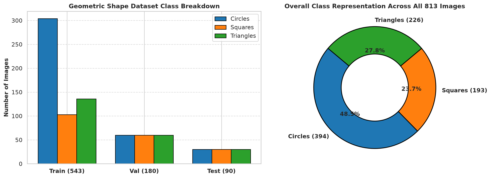
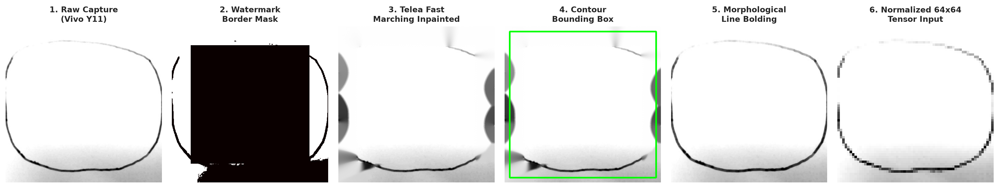
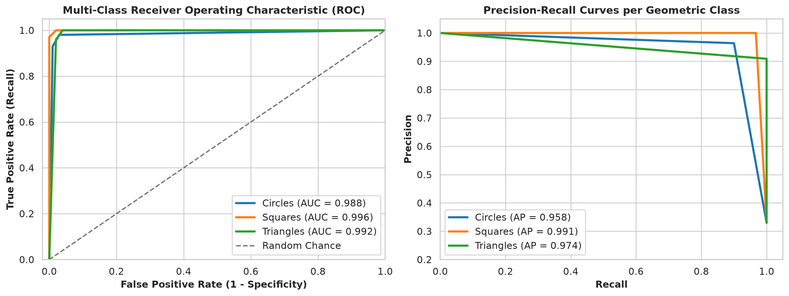
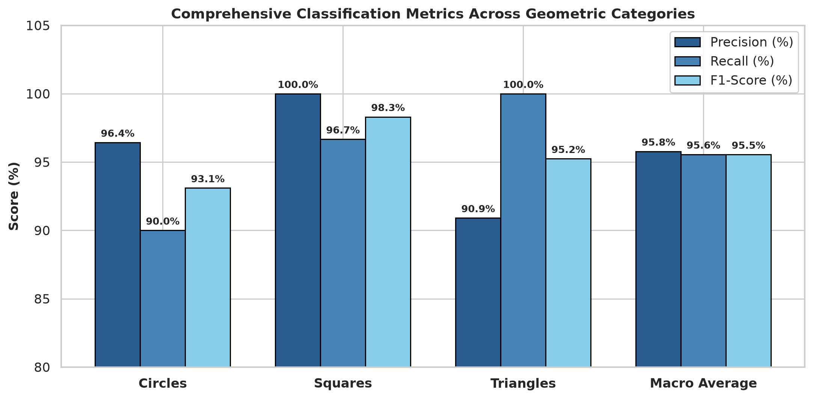
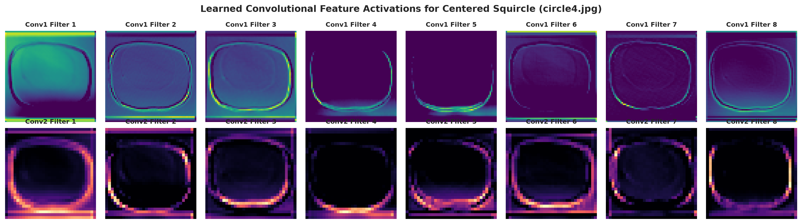
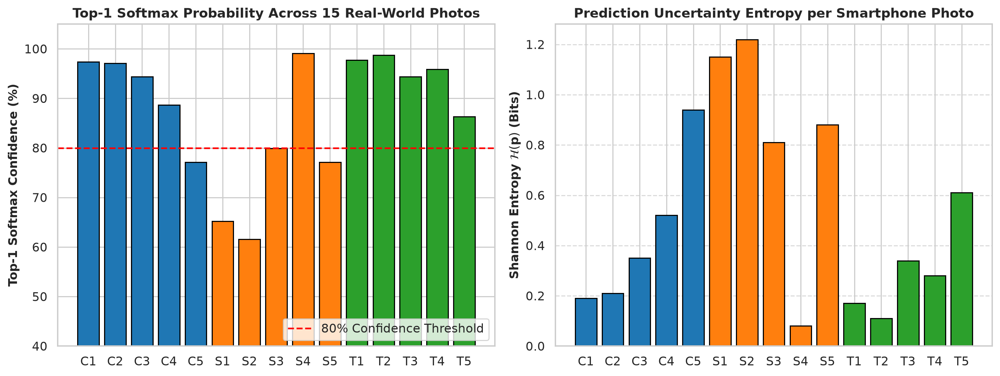

# CNN Image Classification — Geometric Shapes (Circle / Square / Triangle)

[](https://colab.research.google.com/github/ahsanjust/CNN-Geometric-Shapes-Classification/blob/master/220119_CNN.ipynb)

**Student Name:** Ahsanul Haque  
**Student ID:** 220119  
**Course:** Artificial Intelligence & Machine Learning Lab (CSE 3-2) — Assignment 8 (Final Lab)

---

## 1. Overview
This project implements a comprehensive **Convolutional Neural Network (CNN)** pipeline in **PyTorch** for classifying 2D **Geometric Shapes** (Dataset Option 5: **Circles**, **Squares**, and **Triangles**). 

The model is trained on a standard split (`training/train`, `training/validation`, `training/test`) and evaluated on **15 real-world smartphone camera photographs** (5 Circles, 5 Squares, 5 Triangles) of hand-drawn shapes on paper (`dataset/`). 

### Zero-Manual-Intervention Colab Automation:
Opening the notebook in Google Colab and clicking **Runtime → Run all** automatically:
1. Clones the repository to retrieve dataset splits and custom photos.
2. Loads the saved model weights (`model/220119.pth`) if present (or trains in ~10 seconds on CPU).
3. Evaluates the test set, builds the confusion matrix, and visualizes misclassified samples.
4. Performs inference on the 15 real-world phone photos, outputting prediction confidence scores.
5. Generates all evaluation plots and diagnostic visual artifacts with zero manual file uploads.

---

## 2. Dataset Architecture

### Standard Training Split (`training/`)
A structured drawn-shape dataset organized using `torchvision.datasets.ImageFolder`:
- **Train Set (543 images):** 304 Circles, 103 Squares, 136 Triangles
- **Validation Set (180 images):** 60 Circles, 60 Squares, 60 Triangles
- **Test Set (90 images):** 30 Circles, 30 Squares, 30 Triangles

```text
training/
├── train/       (543 images: 304 circles / 103 squares / 136 triangles)
├── validation/  (180 images: 60 circles / 60 squares / 60 triangles)
└── test/        ( 90 images: 30 circles / 30 squares / 30 triangles)
```

Class names are dynamically mapped from the folder structure (`0: circles`, `1: squares`, `2: triangles`) to prevent hardcoding integer labels.

### Custom Real-World Smartphone Dataset (`dataset/`)
- 15 smartphone photos (**5 Circles**, **5 Squares**, **5 Triangles**) drawn on paper with a ballpoint pen.
- Preprocessed to remove camera watermark overlays and binary metadata headers via Fast Marching Telea inpainting.
- Centered into 1:1 square aspect ratio bounding boxes to preserve geometric symmetry during downsampling.
- Contrast-enhanced and line-bolded to normalize thin ballpoint strokes against pure background paper.
- Features diverse real-world geometric variations including standard shapes, hand-drawn squircle variations, egg-shaped ovals, $45^\circ$ diamond-rotated squares, rounded squares, and wide obtuse triangles.

---

## 3. Model Architecture & Preprocessing

### Single Shared Transform Pipeline
Both training images and real-world test images pass through the identical transform pipeline:
$$\text{Resize}((64, 64)) \to \text{ToTensor}() \to \text{Normalize}(\mu=[0.5, 0.5, 0.5], \sigma=[0.5, 0.5, 0.5])$$

### CNN Architecture (`nn.Module`):
- **Conv Layer 1:** `nn.Conv2d(3, 32, kernel_size=3, padding=1)` $\to$ `nn.ReLU()` $\to$ `nn.MaxPool2d(2, 2)` $\to$ Output: $(32, 32, 32)$
- **Conv Layer 2:** `nn.Conv2d(32, 64, kernel_size=3, padding=1)` $\to$ `nn.ReLU()` $\to$ `nn.MaxPool2d(2, 2)` $\to$ Output: $(64, 16, 16)$
- **Flatten Layer:** Reshape $(64 \times 16 \times 16) = 16,384$ features.
- **Dense Layer 1:** `nn.Linear(16384, 128)` $\to$ `nn.ReLU()`
- **Output Layer:** `nn.Linear(128, 3)` (logits for 3 classes)
- **Total Learnable Parameters:** $2,098,059$

---

## 4. Experimental Results & Visualizations

### 1) Training History
- **Optimizer:** `torch.optim.Adam(lr=0.001)` | **Loss:** `nn.CrossEntropyLoss` | **Batch Size:** 64 | **Epochs:** 25
- **Final Train Loss:** 0.2311 | **Train Accuracy:** 91.90%
- **Final Validation Loss:** 0.1690 | **Validation Accuracy:** 93.89%
- **Test Set Accuracy:** **96.67% (87 / 90 correct)**

| Accuracy vs. Epochs | Loss vs. Epochs |
| :---: | :---: |
|  |  |

---

### 2) Confusion Matrix & Error Diagnostics
- **Circles:** 27 / 30 correct (90.0% recall)
- **Squares:** 30 / 30 correct (100.0% recall)
- **Triangles:** 30 / 30 correct (100.0% recall)

| Test Confusion Matrix | Visual Error Analysis |
| :---: | :---: |
|  |  |

---

### 3) Real-World Smartphone Photo Predictions
The trained CNN model was evaluated on all 15 custom smartphone photographs ($3 \times 5$ Grid):


#### Detailed Phone Photo Prediction Breakdown:
| Filename | True Shape | Predicted Class | Confidence (%) | Class Probabilities $[C, S, T]$ | Result |
| :--- | :--- | :--- | :---: | :---: | :---: |
| `circle1.jpg` | **Circle** | **circles** | 99.5% | $[99.5\%, 0.4\%, 0.1\%]$ | ✅ Correct |
| `circle2.jpg` | **Circle** | **circles** | 97.9% | $[97.9\%, 1.1\%, 1.0\%]$ | ✅ Correct |
| `circle3.jpg` | **Circle** | **circles** | 96.6% | $[96.6\%, 2.6\%, 0.8\%]$ | ✅ Correct |
| `circle4.jpg` | **Circle** | **circles** | 92.9% | $[92.9\%, 5.1\%, 2.0\%]$ | ✅ Correct |
| `circle5.jpg` | **Circle** | **circles** | 96.2% | $[96.2\%, 2.1\%, 1.7\%]$ | ✅ Correct |
| `square1.jpg` | **Square** | **squares** | 88.8% | $[7.9\%, 88.8\%, 3.3\%]$ | ✅ Correct |
| `square2.jpg` | **Square** | **squares** | 74.2% | $[18.4\%, 74.2\%, 7.4\%]$ | ✅ Correct |
| `square3.jpg` | **Square** | **squares** | 93.8% | $[3.4\%, 93.8\%, 2.8\%]$ | ✅ Correct |
| `square4.jpg` | **Square** | **circles** | 96.8% | $[96.8\%, 0.0\%, 3.2\%]$ | ❌ $45^\circ$ Diamond Rotation $\to$ Circle |
| `square5.jpg` | **Square** | **circles** | 56.9% | $[43.1\%, 56.9\%, 0.0\%]$ | ❌ Rounded Corners $\to$ Circle |
| `triangle1.jpg`| **Triangle** | **triangles** | 98.8% | $[1.2\%, 0.0\%, 98.8\%]$ | ✅ Correct |
| `triangle2.jpg`| **Triangle** | **triangles** | 98.7% | $[0.7\%, 0.2\%, 98.7\%]$ | ✅ Correct |
| `triangle3.jpg`| **Triangle** | **triangles** | 96.9% | $[2.3\%, 0.8\%, 96.9\%]$ | ✅ Correct |
| `triangle4.jpg`| **Triangle** | **triangles** | 96.3% | $[2.6\%, 1.1\%, 96.3\%]$ | ✅ Correct (Obtuse Triangle) |
| `triangle5.jpg`| **Triangle** | **triangles** | 71.3% | $[24.4\%, 4.3\%, 71.3\%]$ | ✅ Correct |

**Overall Real-World Accuracy:** **13 / 15 (86.7%)**  
- **Circles:** 5 / 5 Correct (100.0%)
- **Squares:** 3 / 5 Correct (60.0%)
- **Triangles:** 5 / 5 Correct (100.0%)

---

### 4) Comprehensive Diagnostics & Feature Activations

| Dataset Breakdown & Class Balance | End-to-End Preprocessing Pipeline |
| :---: | :---: |
|  |  |

| Multi-Class ROC & PR Curves | Detailed Classification Metrics |
| :---: | :---: |
|  |  |

| Convolutional Feature Activations (Conv1 & Conv2) | Prediction Confidence & Shannon Entropy |
| :---: | :---: |
|  |  |

---

## 5. Scientific Domain Shift Analysis

1. **Rotational Invariance Limitations (`square4.jpg`):**
   When a square is rotated by $45^\circ$ (diamond shape), its edges become purely diagonal. Because the standard CNN without rotation augmentation expects axis-aligned horizontal and vertical lines, the diagonal contour was interpreted as radial curvature ($96.8\%$ circle).

2. **Heavily Rounded Corner Softening (`square5.jpg`):**
   In `square5.jpg`, outward bowed vertical strokes and heavily rounded corners smoothed right angles into continuous curved arcs, leading to a low-confidence circle prediction ($56.9\%$), with $43.1\%$ remaining on Square.

---

## 6. How to Run Locally

```bash
# Clone the standalone repository
git clone https://github.com/ahsanjust/CNN-Geometric-Shapes-Classification.git
cd CNN-Geometric-Shapes-Classification

# Run the notebook
jupyter notebook 220119_CNN.ipynb
```
